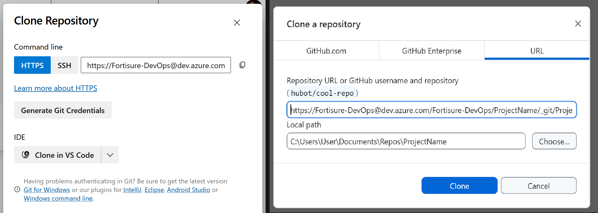
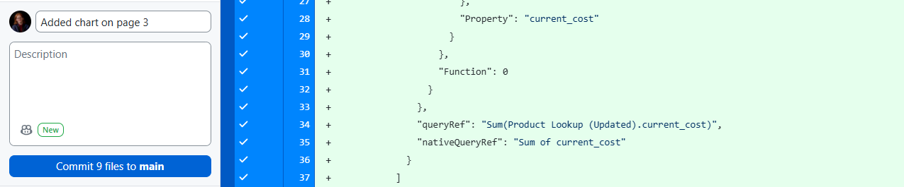

# How to use Azure Repos with Power BI

Read this quick guide if you aren't familiar with using Git or other forms of version control.

## Setup

1. Download a Git client. I recommend GitHub Desktop or VS Code.
    - https://github.com/apps/desktop
    - https://code.visualstudio.com

2. Navigate to the Azure repository. The project should be located on [our organization's homepage](https://dev.azure.com/Fortisure-DevOps). If you need access, talk to Rob Kozak. In the project page, there should be a tab on the sidebar titled "Repos". 

3. Clone the repository to your device. Azure allows for cloning through traditional methods or directly via an IDE. If you are using GitHub Desktop, press `CTRL + SHIFT + O` to bring up the clone menu and paste the HTTPS code into the URL section.

## Save as a *.pbip

For version control to work properly, Power BI projects must be saved as a `.pbip` file type. By default, they are saved as `.pbix`, which is a single binary file. Transitioning is as easy as selecting Save As and choosing `.pbip` in the file dialog. This will give you a project file, 2 folders, and a gitignore. Place all of these in the repository folder.

## Before editing the project

Be sure to update your copy before you start working to avoid conflicts. To do this, simply fetch from the origin ("synchronize changes" in VS Code).
If there are no changes, go ahead and get started. Otherwise, you will need to pull those changes onto your own copy.

**Reload Power BI if it is already open, or the new changes will be lost.**

## Saving changes

To send your changes back to the master copy, you must commit your changes. Write a short message explaining what you changed. Then, push your changes to the origin ("synchronize changes" in VS Code).

## Resolving conflicts

To avoid major conflicts, do not work on the same page that someone else is currently working on. This will result in people's work being overwritten. Regardless of how careful you are, there are two files that may have conflicts anyway: **localSettings.json** and **pages.json**. These files carry per session information like which page of the report was last viewed and do not affect the actual content of the report. If conflicts arise in these files, overwrite the existing files with your own.

